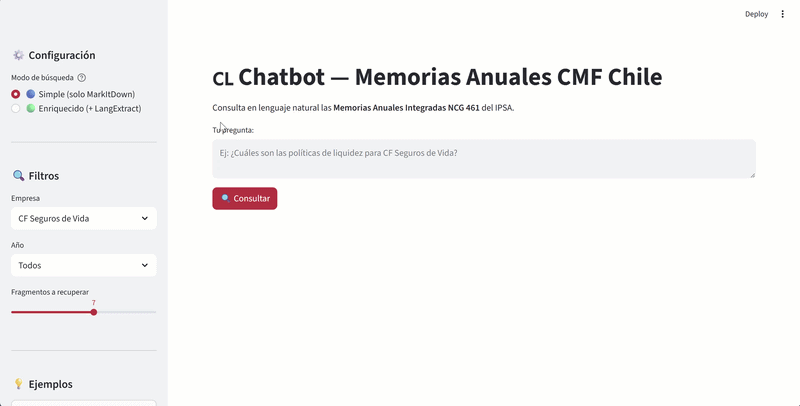
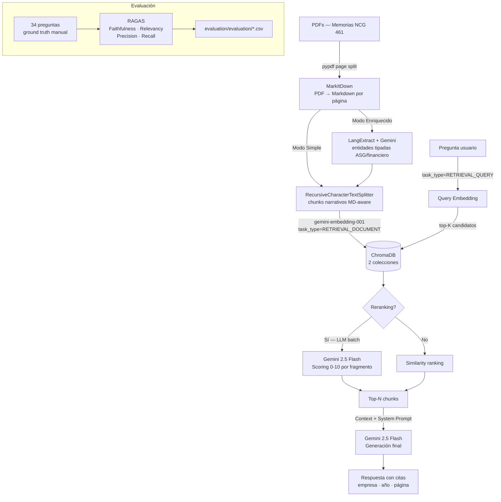

# 🇨🇱 RAG Financial: Memorias Anuales CMF Chile

> Chatbot de análisis financiero y ASG/ESG sobre Memorias Anuales Integradas (NCG 461).
> Dos pipelines comparables evaluados con RAGAS + LLM reranking.



## ¿Qué hace este proyecto?

Sistema RAG (Retrieval-Augmented Generation) para consultar en lenguaje natural las **Memorias Anuales Integradas NCG 461** de empresas del IPSA chileno.

Implementa y compara **cuatro configuraciones** a lo largo de dos ejes:

| Eje | Opción A | Opción B |
|-----|----------|----------|
| **Extracción** | Solo MarkItDown (Modo Simple) | MarkItDown + LangExtract (Modo Enriquecido) |
| **Retrieval** | Embedding similarity puro | Embedding + LLM batch reranking |

La evaluación es completamente reproducible: 34 preguntas con ground-truth manual, medidas con RAGAS (Faithfulness, Answer Relevancy, Context Precision, Context Recall).

---

## Arquitectura del pipeline



---

## Stack y decisiones de diseño

| Capa | Tecnología | Por qué |
|------|-----------|---------|
| Extracción PDF | MarkItDown (Microsoft) | API unificada, tablas → Markdown, multi-formato |
| Extracción estructurada | LangExtract + Gemini (**opcional**) | Entidades tipadas con source grounding |
| Chunking | RecursiveCharacterTextSplitter (MD-aware) | Respeta tablas y headers del Markdown |
| Embeddings | gemini-embedding-001 (768d MRL) | `task_type` dual: DOCUMENT al indexar, QUERY al buscar |
| Vector Store | ChromaDB (2 colecciones) | Una por modo, comparación directa sin reindexar |
| Reranking | Gemini 2.5 Flash batch scoring | Una sola llamada LLM para puntuar todos los fragmentos |
| Generación | Gemini 2.5 Flash | Una API key para todo el stack |
| Evaluación | RAGAS + ground truth manual | 4 métricas × 2 modos × 2 configuraciones de retrieval |
| Interfaz | Streamlit | Selector de modo + visualización de chunks en tiempo real |

---

## Conceptos clave

### 🗄️ ChromaDB
Base de datos vectorial para embeddings. Almacena cada chunk de texto junto a su vector de embeddings y permite búsqueda por similitud coseno en milisegundos. Se eligió porque es ligera, no requiere infraestructura adicional y soporta filtros de metadatos (`company`, `year`) que permiten acotar la búsqueda a una empresa o año específico sin necesidad de re-indexar.

### 🔍 LangExtract
Librería que usa un LLM (Gemini) para extraer entidades estructuradas —indicadores financieros, métricas ASG/ESG, personas clave— directamente desde texto en lenguaje natural, devolviendo JSON tipado con referencia a la fuente original (*source grounding*). En este proyecto se usa opcionalmente para crear un segundo tipo de chunks ("estructurados") además de los chunks narrativos del Markdown, con el objetivo de mejorar la precisión en preguntas sobre valores numéricos concretos. Los resultados RAGAS muestran que en esta colección no aporta mejora neta, lo cual es en sí mismo un hallazgo válido.

### 🔀 Reranking
El retrieval inicial recupera los K chunks más similares al query según distancia coseno entre embeddings. Este criterio es rápido pero impreciso: un fragmento puede ser semánticamente cercano sin contener la respuesta. El reranking aplica un segundo filtro: se envían todos los candidatos a un LLM en una sola llamada (*batch*), que asigna un puntaje de 0–10 a cada uno según qué tan útil es para responder la pregunta específica. Solo los Top-N con mayor puntaje pasan al contexto de generación. Los resultados muestran que este paso mejora Answer Relevancy en **+0.414** y Context Recall en **+0.498**.

### 📐 Métricas RAGAS

| Métrica | Qué mide | Cómo interpretarla |
|---------|----------|--------------------|
| **Faithfulness** | ¿La respuesta generada está respaldada por los chunks recuperados? | Detecta alucinaciones: 1.0 = todo lo que dice el modelo está en el contexto; 0.0 = el modelo inventa. |
| **Answer Relevancy** | ¿La respuesta responde realmente la pregunta formulada? | Penaliza respuestas vagas o fuera de tema, aunque sean fieles al contexto. |
| **Context Precision** | ¿Los chunks recuperados son relevantes para la pregunta? | Mide la señal/ruido del retrieval: 1.0 = todos los chunks recuperados eran necesarios. |
| **Context Recall** | ¿Los chunks recuperados contienen toda la información necesaria para responder? | Mide cobertura: 1.0 = el ground truth está completamente cubierto por el contexto recuperado. |

---

## Resultados RAGAS — 34 preguntas con ground truth manual

### Con LLM Reranking (configuración recomendada)

| Métrica | Modo Simple | Modo Enriquecido | Δ (enr − simp) |
|---------|------------|-----------------|----------------|
| Faithfulness | **0.891** | 0.888 | −0.003 |
| Answer Relevancy | **0.906** | 0.735 | −0.171 |
| Context Precision | **0.716** | 0.536 | −0.180 |
| Context Recall | **0.795** | 0.653 | −0.142 |

### Sin reranking (baseline)

| Métrica | Modo Simple | Modo Enriquecido | Δ (enr − simp) |
|---------|------------|-----------------|----------------|
| Faithfulness | **0.869** | 0.857 | −0.012 |
| Answer Relevancy | **0.492** | 0.433 | −0.059 |
| Context Precision | **0.478** | 0.386 | −0.092 |
| Context Recall | **0.297** | 0.273 | −0.024 |

### Impacto del reranking — Modo Simple

| Métrica | Sin reranking | Con reranking | Mejora |
|---------|--------------|--------------|--------|
| Answer Relevancy | 0.492 | **0.906** | **+0.414** |
| Context Recall | 0.297 | **0.795** | **+0.498** |
| Context Precision | 0.478 | **0.716** | **+0.238** |
| Faithfulness | 0.869 | **0.891** | +0.022 |

> **Conclusiones:**
> 1. El **LLM reranking es el factor dominante**: mejora Answer Relevancy en +0.414 y Context Recall en +0.498 respecto al baseline de similarity puro.
> 2. El **Modo Simple supera al Enriquecido** en todas las métricas — LangExtract no aporta mejora neta sobre esta colección de documentos.
> 3. La configuración óptima es **Simple + Reranking**: máxima calidad con el menor costo de indexado.

### Desglose por categoría — Modo Simple + Reranking

| Categoría | Faithfulness | Ans. Relevancy | Ctx. Precision | Ctx. Recall |
|-----------|-------------|---------------|---------------|------------|
| financiero | 0.742 | 0.944 | 0.697 | 0.721 |
| financiero_narrativa | 1.000 | 0.905 | 0.480 | 0.700 |
| gobernanza | 1.000 | 0.918 | 0.745 | 0.944 |
| riesgo | 0.941 | 0.936 | 0.640 | 0.736 |
| social | 1.000 | 0.954 | 0.821 | 0.750 |
| sostenibilidad | 1.000 | 0.922 | 0.944 | 0.900 |
| ambiental | 1.000 | — ¹ | 1.000 | 1.000 |

> ¹ La categoría *ambiental* obtiene Answer Relevancy = 0.0 porque la empresa no publica datos ambientales cuantitativos; el modelo responde correctamente *"No tengo esa información disponible"*, lo cual RAGAS penaliza como baja relevancia. El comportamiento es correcto.

Los CSVs completos con resultados por pregunta están en [`evaluation/evaluation/`](evaluation/evaluation/).

---

## Estructura del proyecto

```
03_llm_rag/
├── src/
│   ├── extract_pdf.py        # PDF → Markdown por página (MarkItDown)
│   ├── extract_structured.py # Markdown → entidades JSON (LangExtract)
│   ├── chunker.py            # Chunking MD-aware + modo enriquecido
│   ├── embedder.py           # Indexado ChromaDB con gemini-embedding-001
│   └── chain.py              # RAG: retrieve → rerank → generate
├── evaluation/
│   ├── evaluate.py           # Script RAGAS comparativo (simple vs enriched × rr vs sin_rr)
│   └── evaluation/           # CSVs con resultados reproducibles
├── tests/
│   └── test_rag.py           # Suite pytest: retrieval, reranking, answer, chunking, config
├── app.py                    # Interfaz Streamlit con selector de modo
├── config.py                 # Parámetros centralizados (modelos, rutas, flags)
└── environment.yml           # Entorno conda reproducible
```

---

## Cómo ejecutar

```bash
# 1. Entorno
conda env create -f environment.yml
conda activate rag-cmf

# 2. API Key
cp .env.example .env          # Edita .env y añade GOOGLE_API_KEY

# 3. Indexar (Modo Simple — recomendado)
python src/extract_pdf.py     # PDFs → Markdown
python src/chunker.py         # Markdown → chunks  (USE_LANGEXTRACT=False en config.py)
python src/embedder.py        # chunks → ChromaDB

# 4. Interfaz
streamlit run app.py

# --- Opcional ---

# 5. Modo Enriquecido (edita config.py: USE_LANGEXTRACT=True)
python src/extract_structured.py
python src/chunker.py
python src/embedder.py

# 6. Evaluación comparativa
python evaluation/evaluate.py  # Genera CSVs en evaluation/evaluation/

# 7. Tests
pytest tests/ -v
```

---

## Variables de entorno

| Variable | Descripción |
|----------|-------------|
| `GOOGLE_API_KEY` | API key de Google AI Studio — única clave necesaria para todo el stack |

Obtén una clave gratuita en [aistudio.google.com](https://aistudio.google.com/app/apikey).

---

## Docker

> Requires only `GOOGLE_API_KEY` and a pre-indexed `chroma_db/` directory (run the indexing pipeline once locally first).

```bash
# Build and run
docker compose up --build

# Run in background
docker compose up -d --build

# Rebuild after code changes
docker compose up --build --force-recreate
```

The app will be available at **http://localhost:8501**.

The `chroma_db/` folder is mounted read-only into the container — no data is baked into the image. The `.env` file is injected at runtime via `env_file` and is excluded from the image by `.dockerignore`.

To build without compose:
```bash
docker build -t rag-cmf .
docker run -p 8501:8501 --env-file .env -v $(pwd)/chroma_db:/app/chroma_db:ro rag-cmf
```
